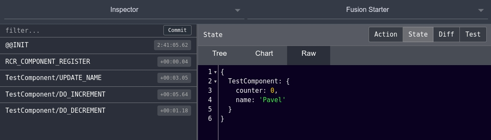

# RCR [](https://travis-ci.org/pashaigood/react-component-redux)
**Redux** отличная библиотека, вот только слишком низкоуровневая для повседневного использования.

Идея в том, что бы упростить использование и сделать процесс создания компонентов как можно быстрее.

Пример:
```javascript
import React from 'react';
import RCR from 'react-component-redux';

@RCR.container
export default class Test extends React.Component {

  /**
   * Начальное состояние компонента.
   * @type {{counter: number, name: string}}
   */
  state = {
    counter: 1,
    name: 'friend'
  };

  /**
   * Список действий компонента.
   *
   * @type {{updateName: ((state, name)), doIncrement: ((state, number)), doDecrement: ((state, number))}}
   */
  actions = {
    updateName(state, name) {
      return {
        ...state,
        name
      }
    },

    doIncrement (state, number) {
      return {
        ...state,
        counter: state.counter + number
      };
    },

    doDecrement(state, number) {
      return {
        ...state,
        counter: state.counter - number
      };
    }
  };

  render = () => (
    <div>
      <h1>Hello {this.state.name} {this.state.counter} times!</h1>
      <div className="form-group">
        <input
          className="form-control"
          type="text"
          value={this.state.name}
          onChange={e => this.actions.updateName(e.target.value)}
        />
      </div>
      <button
        className="btn btn-default"
        onClick={() => this.actions.doIncrement(1)}>+
      </button>
      <button
        className="btn btn-default"
        onClick={() => this.actions.doDecrement(2)}>-
      </button>
    </div>
  )
}
```

И это весть код!

Мы абстрагировались от низкого уровня управления данными, к которому всегда можем вернутся и получили **умный** компонент.

Не нужно настраивать ни хранилища, не нужно писать ни _actions_, ни _actionsCreators_, ни _reducers_.
Да конечно, этот подход не универсален, но покрывает простое использование **Redux**.
В данном подходе есть противоречия с философией чистых функций, и это вопрос обсуждаем, можно ли заменить на _договоренность_ в угоду увеличения производительности.

## Множественное использование компонента.

Большая проблема использование redux - переиспользование компонента.
Автоматизируя работу с данными этот вопрос решается очень просто.


[код компонента](./examples/containers/MultiInstance.js)

Использование очень простое, достаточно просто дать экземпляру собственное имя:
```html
<div className="row">
  <div className="col-xs-4"><MultiInstance title="First instance with common state."/></div>
  <div className="col-xs-4">
    <MultiInstance name="other-instance" title="Second instance with own state."/>
  </div>
  <div className="col-xs-4"><MultiInstance title="Third instance with common state."/></div>
</div>
```
Таким образом создастся новое хранилище **other-instance**, на котором может ссылаться любое количество новых экземпляров компонента.

## Подробнее
Вот так выглядит простой набор действий:



Вот так будет выглядеть действие:

```json
{
  "type": "TestComponent/DO_DECREMENT",
  "meta": {
    "component": "TestComponent"
  },
  "payload": [
    2
  ]
}
```

Самым интересным тут будет _payload_, который по сути является списком параметром, передаваемых функции _actions.doDecrement_.
