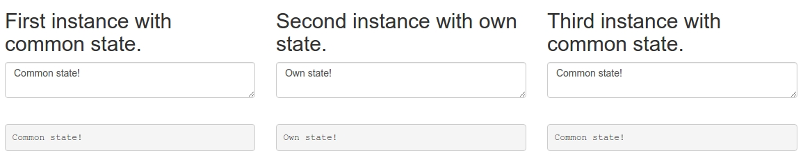

# RCR [](https://travis-ci.org/pashaigood/react-component-redux) [](https://github.com/semantic-release/semantic-release)
**Redux** a great library, that's just too low-level for everyday use.

The idea is to simplify the usage and make the process of creating components as quickly as possible.

Пример:
```javascript
import React from 'react';
import RCR from 'react-component-redux';

// Apply the decorator.
@RCR.container
export default class Hello extends React.Component {

  /**
   * Write the initial state.
   */
  state = {
    counter: 1,
    name: 'friend'
  };

  /**
   * Describe the component's actions list.
   */
  actions = {
    updateName(state, name) {
      return {
        ...state,
        name
      };
    },

    doIncrement(state, number) {
      return {
        ...state,
        counter: state.counter + number
      };
    },

    doDecrement(state, number) {
      return {
        ...state,
        counter: state.counter - number
      };
    }
  };

  render() {
    return (
      <div>
        <h1>Hello {this.state.name} {this.state.counter} times!</h1>
        <div className="form-group">
          <input
            placeholder="Type your name..."
            className="form-control"
            type="text"
            value={this.state.name}
            onChange={e => this.actions.updateName(e.target.value)}
          />
        </div>
        <button
          className="btn btn-default"
          onClick={() => this.actions.doIncrement(1)}>+
        </button>
        <button
          className="btn btn-default"
          onClick={() => this.actions.doDecrement(2)}>-
        </button>
      </div>
    );
  }
}
```

And it's all the code!

Want even more clean code? You are welcome!

```javascript
// PureComponent.js
import React from 'react';
import RCR from 'react-component-redux';
import * as reducers from  './reducers';

function PureFunction({number, random}) {
  return (
    <div>
      <h2>Pure</h2>
      <pre onClick={e => random()}>{number || 'Click to see some random magic!'}</pre>
    </div>
  );
}

export default RCR.pure(PureFunction, {reducers});
```

```javascript
// reducers.js
export const state = {
  number: undefined
};

export function random(state) {
  return {
    ...state,
    number: Math.round(Math.random() * 1000)
  };
}
```

We abstracted from low-level data management, which can always come back and got a **smart** component.
No need to set no store, no need to write any _actions_ or _actionsCreators_ or _reducers_.
Yes, of course, this approach is not universal, but it covers the simple use of **Redux**.

## Multiple use of components

Most **Redux** problem - component reuse.
After the automation of the data, this problem is solved very simply.



[component code example](./examples/containers/MultiInstance.js)

Using a very simple, enough to give the instance its own name:
```html
<div className="row">
  <div className="col-xs-4"><MultiInstance title="First instance with common state."/></div>
  <div className="col-xs-4">
    <MultiInstance name="other-instance" title="Second instance with own state."/>
  </div>
  <div className="col-xs-4"><MultiInstance title="Third instance with common state."/></div>
</div>
```
Thus is created a new repository **other-instance**, which can be referenced any number of new instances of a component.

## More
Here's what a simple set of actions:


Here is the action:

```json
{
  "type": "TestComponent/DO_DECREMENT",
  "meta": {
    "component": "TestComponent"
  },
  "payload": [
    2
  ]
}
```

The most interesting here is _payload_, which is essentially a list of parameters that are passed _actions.doDecrement_ function.
